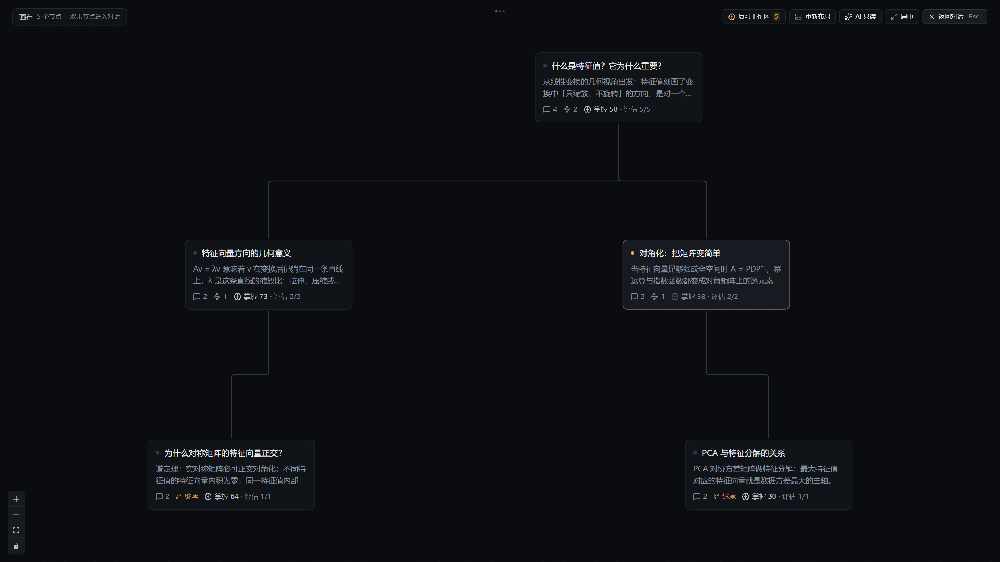

<div align="center">
  <h1>OpenTreeLearn</h1>
  <p><strong>对话即内容的树状学习工作台</strong></p>
  <p>简体中文 · <a href="README.en.md">English</a></p>
  
</div>

## 简介

学习不是刷完一篇文章，而是长出一棵树。OpenTreeLearn 把「学一个主题」的过程变成一棵**可回看、可分叉、可追溯**的学习树：

- **每个节点是一条对话线程**——节点没有独立正文，聊天本身就是内容生产方式；标题、摘要、掌握度由 AI 自动沉淀。
- **树即路径**——你在某个节点里从任意一条消息分叉出新问题，画布上就多出一条分支；「怎么一步步学会的」这条路径完整保留。
- **Agent 即协作者**——Agent 读得懂整棵树：按需检索、记得你的错题与标注、主动规划复习，并在你授权后直接整理树（可提议、分步执行、随时撤销）。
- **记住是被安排好的**——内置 FSRS 间隔重复，复习中心按记忆状态安排每张卡片的下一次见面。

本地优先：数据存在你自己的浏览器（IndexedDB），不上传任何内容；不提供模型服务，请自行在配置页面配置BYOK供应商。

## 核心概念

| 概念 | 含义 |
| --- | --- |
| **Project** | 一个学习主题，带标签、个人背景与默认模型设置 |
| **Node** | 一条对话线程，即内容本身；画布上的卡片，含掌握度与复习状态 |
| **Fork** | 从某条消息处分出的子节点，继承上下文、记录来源 |
| **Agent** | 可感知整棵树、在授权下执行可逆操作的协作者 |
| **复习中心** | 每个项目一个，基于 FSRS 安排间隔重复 |

## 功能特性

- 🌳 **学习树画布**——节点卡片 + 直角连线，拖拽整理、自动布局、记忆热力图
- 💬 **对话即内容**——Markdown / 代码高亮（Shiki）/ 数学公式（KaTeX），引用块可标注为错题或疑点
- 🌿 **任意分叉**——从任何一条消息长出新分支，上下文自动继承
- 🤖 **Agent 循环**——原生 function calling，只读工具随时可用，写操作默认关闭、显式开启且仅限可逆操作
- 🔁 **FSRS 复习**——间隔重复 + 掌握度聚合（子树均值），薄弱点自动进入复习材料
- 🔒 **本地优先**——IndexedDB 存储，离线可用；可选跨端同步（自托管）
- 🔑 **BYOK 多模型**——OpenAI / Anthropic / Google / 任意 OpenAI 兼容接口（LM Studio、Ollama、new-api 等）
- 🌐 **中文为主，双语界面**（zh-CN / en，设置页可切换）

## 快速开始

> 要求：Node.js ≥ 20.19（或 ≥ 22.12）与 pnpm

```bash
pnpm install
pnpm dev            # 前端 http://localhost:6174
```

打开后：**创建项目 → 设置页填入你自己的模型 API Key → 开始第一次对话**。
API Key 只存在你本地浏览器的 IndexedDB / localStorage 中。

可选（本地联调同步服务）：

```bash
pnpm dev:all        # 前端 + NestJS 同步服务（:3901）
```

## Docker 部署

```bash
cp .env.docker.example .env   # 可选：覆盖对外端口等
docker compose up -d --build  # web(nginx) + api(同步服务 + SQLite)
# 访问 http://localhost:8080
```

生产部署下前端是静态站点（nginx 同源反代 `/lern-api`），同步数据落在 SQLite 卷里。

## 多端同步（可选）

前端 local-first：**不开启同步，数据永远只在你本地。**

开启同步时，学习数据存储在**你自己部署的同步服务**里（`server/`，NestJS + SQLite，增量 pull/push）——Docker 部署时数据落在你自己的 SQLite 数据卷中，**不会上传到作者的任何服务器**。

唯一涉及作者实例的是**账号登录**：前端内置的登录入口连的是账号服务（硬编码于 `src/services/account/client.ts` 的 `https://api.sakta.top`），它只签发并校验身份 token，**不存储任何学习数据**；想连身份都完全自托管，把该常量改为你自己的账号服务并重新构建即可。

## 开发

```bash
pnpm build        # 类型检查 + 构建前端
pnpm lint         # ESLint
pnpm test         # Vitest
pnpm typecheck    # tsc --noEmit
```

技术栈：React 19 · Vite · Tailwind CSS v4 · Radix UI / shadcn 风格组件 · @xyflow/react（画布）· Dexie（IndexedDB）· ts-fsrs · AI SDK · NestJS + Prisma + SQLite（同步服务）

## License

本项目以 [MIT](LICENSE) 协议开源。
