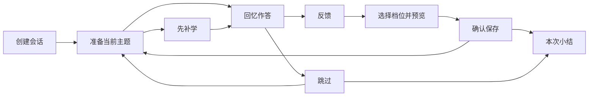

# T-128 掌握度与复习体验重构方案

> 状态：待实施，可用于设计、开发与测试交接。本文描述目标行为，不代表功能已经实现。
>
> 日期：2026-09-22。审查基线：T-128 提交 `362c71e`，并参考当前 `6dc1c9f` 的代码。
>
> 范围：重构 T-128 新增功能的交互与承载方式，沿用现有项目、学习树、节点对话和视觉系统。本次交付仅为文档。
>
> 与原设计的关系：实施本方案时，掌握度与复习交互以本文为准；原 [设计文档](D:/project/ai-generate/opentreelearn/docs/design.md) 第 14 节用于理解历史实现。开发完成后同步修订第 14 节，避免两份规格互相矛盾。

## 1. 重构结论

把复习从“一个特殊聊天节点加几条操作栏”改成**项目内独立、可恢复的复习工作模式**。

用户应当能连续完成：知道该复习什么 → 开始一小批 → 回忆与回答 → 获得反馈 → 确认掌握情况 → 回到原来的学习。整个过程保持稳定的界面位置，不依赖在复习中心与多个原节点之间来回切换。

同时，将掌握度从一个可点击但含义不清的分数，改成**可以查看依据、薄弱点与复习安排的学习反馈**。

### 1.1 本期必须落实的决定

| 编号 | 决定 |
| --- | --- |
| D01 | 复习入口位于项目工作区；不再创建新的 `kind: 'review'` 节点。 |
| D02 | 首页、画布、节点详情中的复习入口，统一进入同一个复习工作区。 |
| D03 | 默认推荐一批 3 个到期主题，允许调整，每批最多 20 个；不宣称“每天只能复习 20 个”。 |
| D04 | “只复习这个主题”严格创建单主题会话，不追加其他到期主题。 |
| D05 | 点击开始后自动生成第一道回忆题；需要补学时先进入补学步骤，无须再找“出题”按钮。 |
| D06 | 复习对话独立保存，原学习对话作为按需展开的参考材料；评分仍回写原节点。 |
| D07 | 评分在反馈阶段出现；选择档位只预览，明确确认后才保存并进入下一主题。 |
| D08 | 支持跳过、暂停、刷新后继续、撤销最近一次评分。 |
| D09 | 点击学习状态只查看详情；只有明确点击“生成 / 更新学习评估”才调用评估模型。 |
| D10 | 生成摘要与加入复习计划分开；旧计划保留，新主题由用户明确加入。 |
| D11 | 普通学习对话不持续插入复习提示；首页不再重复弹出到期通知。 |
| D12 | 旧复习中心及其消息、笔记、分支关系保留，并提供历史访问入口。 |

### 1.2 边界

本期保留现有 FSRS 适配层、四档评分、遗忘率计算、队列排序与交错原则，重点调整产品状态与组织方式。保留项目路由、节点分支语义、T-127 编辑重发与版本选择能力。

本期不建设跨项目连续复习、跨端会话接力、多人协作、题库、积分或打卡系统；不重新训练调度参数；不整体改版应用导航与品牌。复习会话记录先在本机按账号保存，节点掌握度与排期继续沿用现有节点同步。

## 2. 当前问题与代码依据

以下结论来自代码与提交审查，尚未开展实际用户访谈或可用性测试。

| 当前行为 | 体验问题 | 主要位置（仓库内路径） |
| --- | --- | --- |
| 复习中心是特殊根节点，面板挂在普通聊天上方 | 计划页、聊天页与任务入口混合，难以判断在哪里完成复习 | `domain/review/center.ts`、`features/review/ReviewCenterPanel.tsx`、`features/chat/FocusChatView.tsx` |
| 开始会话只选中队列首节点，出题需要再次点击 | 点击开始没有直接得到题目；历史答案默认暴露 | `stores/workspace-store.ts:startReviewSession`、`features/review/ReviewSessionBar.tsx` |
| 出题、结束、保持率、薄弱点、四档评分挤在输入框上方 | 缺少阶段层级，未回答也可评分 | `features/review/ReviewSessionBar.tsx` |
| 掌握度标签的点击操作调用 `refreshSummary` | 用户想查看解释，却触发模型请求和数据更新 | `features/chat/FocusChatView.tsx:MasteryIndicator` |
| 首次生成评估就种卡并进入复习池 | 用户没有明确选择，却开始积累复习任务 | `stores/workspace-store.ts:setNodeAssessment` |
| 顺手复习将指定节点前移，但保留整个队列 | “复习一个”的预期变成一整批任务 | `features/review/ReviewNudge.tsx`、`startReviewSession` |
| 提示按最近回答轮次出现；首页另有每日 toast | 复习信息反复占用学习注意力 | `ReviewNudge.tsx`、`features/projects/TodayReviewPanel.tsx` |
| 会话只在内存中，项目重载会清空 | 刷新、切项目或部分同步重载会丢进度 | `stores/workspace-store.ts`、`stores/data-session.ts` |
| 队列常量名为 `DAILY_REVIEW_CAP`，实现仅为本次队列截断 | “每天上限”和实际行为不一致 | `domain/review/queue.ts` |

上表中的短路径均位于 `src/` 下。不要仅通过改按钮文案、扩大操作栏或增加弹窗来交付本次重构。

## 3. 用户路径与信息架构

### 3.1 从项目开始一小批复习

```text
项目工作区「复习 · 6」
  → 今日复习概览：默认选中推荐的 3 个主题
  →「开始这 3 个」
  → 第 1 个主题自动出题 / 进入补学
  → 回答、反馈、确认评分
  → 依次处理剩余主题
  → 小结 → 返回学习
```

“3 个”是推荐批次大小，不是完成目标或时间承诺。不展示未经测量的“预计 3 分钟”等数字。

### 3.2 从节点只复习一个主题

```text
节点学习状态详情 →「复习这个主题」
  → 单主题会话 → 反馈与确认 → 小结
  → 返回原节点及进入前的位置
```

已加入计划且有有效评估的节点，即使尚未到期，也允许用户主动提前复习；按实际确认时间重新排期。未加入计划的节点先显示“加入复习计划”的明确操作，不通过“复习”按钮暗中加入。

### 3.3 学习后整理与加入计划

```text
学习状态详情 →「生成学习评估」
  → 摘要、当前学习状态、薄弱点
  → 用户可选「加入复习计划」
  → 展示下次复习安排
```

普通对话的发送、回答完成、打开节点、打开状态详情均不自动评估，也不自动出题。已有计划的节点更新评估后保留原排期。

### 3.4 暂停后继续

```text
复习中「稍后继续」 / 离开工作区
  → 保存当前会话与输入草稿
  → 项目复习入口显示“继续复习 · 已完成 1/3”
  → 恢复同一题、回答与反馈，不重新生成已完成内容
```

### 3.5 路由与返回规则

推荐沿用 `/p/:projectId`，通过查询参数表达工作区模式：

| 地址 | 页面 |
| --- | --- |
| `/p/:projectId` | 现有学习工作区 |
| `/p/:projectId?view=review` | 本项目复习概览 |
| `/p/:projectId?view=review&session=:sessionId` | 本项目指定会话；根据持久化状态显示练习、暂停或小结 |

进入复习前记录原节点、工作区模式、画布视口与可恢复的对话滚动位置。未发送的学习对话草稿不得因切换模式而丢失。首次直接访问复习地址时，返回目标退化为本项目学习工作区。

浏览器返回与页面内返回都保存进度。错误或已删除的会话 ID 回到概览并给轻量说明；不能进入其他项目或账号的会话。兼容现有首页导航中的 `location.state.openReviewCenter`，将其一次性转换为新入口。

**实现注意：**当前 `CanvasPage` 的项目加载 effect 依赖导航 key，并在清理时 reset。模式切换应与项目数据加载解耦，不能每次改变查询参数就清空工作区或会话。

## 4. 页面规格

### 4.1 项目入口与首页

- 在项目内提供常驻文字入口“复习”，带到期数；不能只藏在微缩地图中的小图标或 hover 菜单里。
- 有未完成会话时优先显示“继续复习”，旁边说明本批进度。到期统计与会话进度是两个不同概念。
- 首页仍按项目展示到期概况，点击进入该项目概览；存在草稿时可直接继续。
- 到期数使用同一派生口径，评分、计划开关、归档、导入、同步完成及时间跨过到期点后刷新；页面重新聚焦时刷新。
- “到期 6，其中较早待复习 2”中的 2 是 6 的子集，不能相加为 8。
- 首页取消到期 toast。没有到期主题时不展示大幅提醒；有未完成会话时仍展示继续入口。

### 4.2 今日复习概览

桌面结构示意（内容为布局示例）：

```text
← 返回学习                  线性代数 / 复习

今天有 6 个主题适合巩固
先从 3 个开始，也可以自己选。

[✓] 特征值与特征向量        到期复习         查看学习资料
[✓] 正交投影                先补学           查看学习资料
[✓] 基与维数                到期复习         查看学习资料
[ ] 其余到期主题……

已选 3 个                         [开始这 3 个]
```

要求：

- 首屏回答“复习什么、为什么、从哪里开始”。默认不堆放分数、保持率、逾期天数等指标。
- 列表展示全部候选项，长列表滚动；每项显示标题、必要的父级路径和简短原因。标题相同的节点必须可区分。
- 默认选中排序后的前 `min(3, 候选数)` 项，支持勾选调整、只选一个、取消选择。最多选择 20 个，达到上限时明确说明。
- 会话顺序沿用现有排序与交错逻辑；展示的选择顺序和实际进入顺序保持一致。
- 非到期的已加入主题通过次级“选择其他主题”入口进入，标注“提前复习”。不把它们混入默认到期推荐。
- 项目存在未完成会话时，概览先显示该会话与“继续 / 结束本次”操作；同一项目不同时创建两份未完成会话。
- 点击开始先校验数据与模型，再创建会话并生成当前题；双击不创建重复会话或重复模型请求。
- 已完成当前批次但还有到期项时，小结提供“再选一批”，不自动追加。

状态要求：

| 状态 | 展示与动作 |
| --- | --- |
| 正在读取 | 稳定占位；不可将读取中的空数组显示成“今天完成了” |
| 有到期项 | 推荐列表与一个主要开始按钮 |
| 暂无到期项，但已有计划 | “当前没有到期主题”；可查看下次安排或主动选择其他主题 |
| 尚未加入任何主题 | 说明先生成评估并加入计划；给“返回学习”，不触发批量评估 |
| 有掌握度但缺排期的旧节点 | 标注“首次复习”，不可显示“逾期 19700 天” |
| 加载失败 | 内联说明与重试；保留已读取的内容和用户选择 |
| 未配置对话模型 | 展示配置入口，返回后保留选择；不创建空转会话 |

### 4.3 复习工作区

```text
← 稍后继续          正交投影     2 / 3 个主题          学习资料

用自己的话解释：为什么投影后的残差与子空间正交？

我的回答
┌────────────────────────────────────────────────────────┐
│                                                        │
└────────────────────────────────────────────────────────┘

给一点提示     暂时想不起来     跳过                 [提交回答]
```

布局规则：

- 页面顶部固定展示项目、当前主题、进度与退出动作。步骤变化不重新排列页面骨架。
- 中间只呈现本主题本次练习的题目、回答与反馈，允许自然滚动；不要把四个阶段做成四次弹窗。
- 原学习资料默认收起；桌面在右侧打开，窄屏使用独立抽屉，关闭后回到相同练习位置。
- 资料包括当前可见版本的原对话、学习摘要、笔记和主题路径。区分“查看资料”与“离开复习去原节点”。
- 每个主题固定本次使用的内容版本，不能一边出题一边跟随原节点切版本。发生变化时按第 6 节处理。
- 本期每个主题完成一次评分即结束该项；追问、提示、换个问法都属于同一主题，不增加进度分母。
- 主按钮跟随阶段变化：提交回答 → 确认并继续；最后一个主题显示“确认并查看小结”。

阶段规则：

| 阶段 | 页面内容 | 可用动作与限制 |
| --- | --- | --- |
| 准备题目 | 当前主题和加载反馈 | 可以暂停、停止或跳过；不能提交评分 |
| 回忆 | 一道问题与输入区 | 提交、提示、换个问法、想不起来、查看资料、跳过 |
| 补学 | 简洁关键点与“准备好了，试着复述” | 用户确认后出一道复述题；不能仅因为看完讲解就自动记为掌握 |
| 正在反馈 | 保留题目和已提交回答 | 可以停止生成；不能将未完成回答中的评分标记当成有效建议 |
| 反馈与评分 | 做对之处、待补充处、可选评分 | 可以继续追问、选择档位、确认；选择本身不写入排期 |
| 保存中 | 保留反馈与当前选择 | 禁止重复确认；成功后才切换主题，失败留在原地重试 |

具体约定：

- “暂时想不起来”向模型请求简洁讲解并进入反馈，自评默认建议“没想起来”，仍需用户确认。
- 使用提示或查看资料后，展示轻量说明“本次参考过提示 / 资料”，供用户自评参考；不暗中修改评分，也不强制降档。
- “换个问法”重新表达当前知识点，不偷偷增加新题；已有草稿保留，旧问题作为当前会话历史保留。
- 追问后仍停留在本主题，只有完整反馈可更新 AI 建议；用户已经手动选择的档位不被后续建议覆盖。
- 允许继续补充回答；补充属于同一项，在最终确认前不会产生第二次调度。

### 4.4 评分与撤销

评分沿用四档内部值，界面文案调整为：

| 内部值 | 用户文案 | 辅助说明 |
| --- | --- | --- |
| `again` | 没想起来 | 需要重新梳理关键点 |
| `hard` | 有点吃力 | 能想起一部分，但需要提示 |
| `good` | 基本掌握 | 能独立说明主要内容 |
| `easy` | 很熟悉 | 能顺畅解释并应用 |

- AI 建议是可覆盖的默认选择，标明“根据本次回答建议”。没有有效建议时必须由用户选择，不默认记为 `good`。
- 当前选项旁展示“下次复习：……”；日期通过真实调度函数预览，不能硬编码“1 / 3 / 7 / 15 天”。分钟级安排如实显示。
- 预览使用同一评分前基准和计算时间；确认时刷新实际安排，避免长时间停留后的预览与落库结果明显不一致。
- 主要操作为“确认并继续”。保存成功后自动进入下一主题，持久展示“已记录 · 撤销上次评分”，不能只给短暂 toast。
- 撤销窗口：下一主题尚未提交回答、未主动进行补学交互前有效；仅自动展示补学内容不关闭窗口。最后一项可在本次小结中撤销，开始新批次后关闭上一批次的撤销入口。暂停恢复后规则相同，历史记录页只读。
- 撤销时中止下一主题未完成的请求，退回上一项反馈，恢复评分前的掌握度和卡片；再次确认按同一基准重算。
- 若下一主题已有输入草稿，撤销时保留草稿，稍后返回可继续编辑。
- 如果对应节点已经被同步或其他标签页修改，不得用旧快照覆盖新状态；显示“学习记录已更新，无法撤销这次评分”，保留当前记录。

### 4.5 跳过、暂停与小结

“跳过”只影响本批进度，不改变掌握度、不推进排期、不伪装成完成复习。本批不自动把它重新插回队尾；小结列出跳过项，用户可重新选择。

“稍后继续”保存当前题、草稿、完整消息、阶段、已确认结果与返回位置，然后回到学习。直接切项目、浏览器返回和刷新也应保留最近已保存状态。无法写入本地存储时必须明确告知，不能显示“已保存”。

“结束本次”放在次级操作中：保留已确认结果，剩余项记为未完成，进入部分完成小结；不撤销已经完成的复习。再次复习要创建新批次。

小结显示：已复习数、跳过数、未完成数；每项的确认档位与下次安排；本次反馈中明确提到的待巩固点。薄弱点来源不明或反馈失败时不生成虚构总结。

主操作为“返回学习”，次操作为“再选一批”。全部跳过时使用“本次已结束”，不能显示“全部掌握”。

## 5. 掌握度、计划与画布反馈

### 5.1 信息层级

节点标题旁只放一个简洁学习状态入口，点击打开详情。默认状态文案按现有分档映射为“待巩固 / 初步理解 / 基本掌握 / 较熟悉”；未评估显示“学习状态”，不显示 0 分。

详情依次展示：

1. 最近一次学习摘要及更新时间。
2. 当前掌握状态、来源与参考分数。说明该状态来自对话评估或复习反馈，不将其表现为客观考试成绩。
3. 最近评估发现的薄弱点；如果不是本次复习产生的，注明“上次学习评估”。
4. 复习计划：未加入 / 已加入、下次安排、最近确认档位；保持率放在次级解释中。
5. 操作：“生成 / 更新学习评估”“加入 / 移出复习计划”“复习这个主题”。

掌握分数和保持率分别说明：前者是最近证据形成的估计，后者是排期模型随时间计算的记忆估计。两者不能共用一个“熟练度”标题，也不应在默认节点卡片上同时堆叠。

“已过期”替换为“评估后有新的学习内容”。本期可继续沿用现有 6 小时阈值，但必须保留评估所依据的学习时间；复习评分更新时间不能伪装成摘要、薄弱点刚刚被重新评估。对明显不同的对话版本另行标注“评估基于另一版本”。

### 5.2 加入和移出计划

- 新主题默认不在计划中。生成评估后显示“加入复习计划”，用户点击才初始化卡片。
- 有学习对话但暂无评估时，可以明确执行“生成评估”；内容不足或模型未配置时解释原因，不能点了没有反应。
- 评估服务只返回摘要、没有可信掌握度时，保存摘要并说明“本次未获得掌握度评估”；不得补一个默认分数，也不得初始化排期。
- 更新评估失败时保留旧摘要和状态，提供内联重试，避免当前 `catch → null` 造成无声失败。
- 已加入的主题重新生成评估，不能重置已有卡片；缺卡时仍保持“首次复习”的兼容语义。
- 移出计划停止到期提醒，保留历史卡片与学习反馈；重新加入时恢复原安排。过期卡片重新加入后立即进入到期集合，不伪装成新学过。
- 加入、移出本身不增加 `reps`、不作为一次复习。首次种卡仍采用现有初始化函数，其内部计数不得直接当作“用户已完成次数”展示。

### 5.3 学习树与提醒

- 常规画布继续突出标题、摘要、结构。到期使用轻量图标或小标记，不默认将整张卡片改成警告色。
- 提供按需开启的“复习热力”视图。开启后复用现有热力阈值，提供图例；色彩之外保留文字或图标语义。
- 微缩导航的当前选中态和复习到期态必须可区分；恢复选中节点不能依赖热力颜色。
- 子树聚合保留为详情信息，明确“已评估 X / Y 个主题”，不把未评估算成零分。
- 移除按每轮模型回答触发的 `ReviewNudge`。本期如保留顺手入口，只在用户完成“整理 / 评估本次学习”后静态呈现一次，关闭后本次学习不再出现；入口必须严格只处理标明的一个主题。

## 6. 会话状态与异常约定

### 6.1 两层状态

会话状态与当前项阶段分开，避免用 `cursor`、`finishedAt` 与多个布尔值拼接隐含流程。

| 会话状态 | 含义 |
| --- | --- |
| `active` | 当前会话正在进行 |
| `paused` | 可从保存的阶段恢复 |
| `completed` | 本批所有项已评分、跳过或标记不可用；完成的是批次流程，不表示全部掌握 |
| `ended` | 用户主动结束，剩余项未完成 |

当前项阶段至少区分 `preparing`、`relearning`、`answering`、`evaluating`、`feedback`、`saving`、`done`、`skipped`、`unavailable`。请求错误作为可恢复信息挂在相应阶段，保留上一个稳定状态与用户内容。



暂停、恢复、请求失败与撤销是跨阶段事件，按下表执行；不能只实现上图的成功路径。

### 6.2 必须处理的边界

| 场景 | 目标行为 |
| --- | --- |
| 开始时首项已被删除、归档或移出计划 | 校验后剔除并说明，采用用户剩余选择；不自动补进未选择项 |
| 会话中节点失效 | 当前项转 `unavailable`，不评分；允许继续，记录“小结中已不可用” |
| 首项出题失败 | 留在本项，显示重试和跳过；不创建重复会话 |
| 反馈请求失败 | 保留原回答；允许重试，或明确选择“自行评价”进入评分 |
| 生成被停止 / 网络中断 | 部分文本标记为未完成；不采纳其中评分标记，不自动推进 |
| 刷新时正在请求 | 恢复已落库内容与草稿，显示“上次生成已中断”；等待用户重试，不自动重复付费请求 |
| 新题开始后旧请求才返回 | 以账号库、会话、项和请求 ID 校验，丢弃迟到回调 |
| 连续点击确认 / 两标签页确认 | 同一操作仅生效一次；状态冲突时提示刷新当前项，不能再次加次数 |
| 写入失败 | 排期、结果与进度保持同一个事务结果；按钮恢复可重试，不先切页 |
| 暂停跨天 | 队列与顺序保持，已评分项不重新加入；用当前时间计算后续评分 |
| 当前主题在别处产生新版本 | 已开始的题目保持题材快照，提示资料有更新；原文仍可查看。尚未开始的项可刷新资料快照 |
| 同步更新了当前节点的掌握度 / 卡片 | 保存前检测冲突并重新展示预览，请用户再次确认；不得用开始会话时的陈旧基准覆盖 |
| 切换账号或退出登录 | 先保存可保存的状态并取消请求；清空内存中的旧账号会话，新账号只读自己的数据库 |
| 会话草稿损坏或版本不可识别 | 保留可读记录，回到概览解释无法继续；不能默默重播评分 |
| 所有项被跳过或不可用 | 可以正常结束，显示真实计数与原因 |

## 7. 实现结构与数据约定

本节为推荐拆分，文件名可按项目习惯调整；状态语义、事务一致性与兼容规则不可省略。

### 7.1 职责拆分

| 层 | 建议职责 |
| --- | --- |
| `features/review/ReviewWorkspace.tsx` | 复习模式容器与概览 / 会话 / 小结切换 |
| `ReviewOverview.tsx` | 候选选择、继续入口、空态 |
| `ReviewPractice.tsx`、`ReviewFeedback.tsx` | 当前项交互与阶段动作 |
| `ReviewSourcePanel.tsx` | 原资料只读浏览，复用 Markdown 与笔记渲染能力 |
| `ReviewSummary.tsx`、`LearningStatusPopover.tsx` | 小结及学习反馈详情 |
| `domain/review/session.ts` | 状态迁移、选择范围、跳过 / 恢复规则；纯逻辑 |
| `domain/review/queue.ts`、`schedule.ts`、`fsrs.ts` | 候选排序、计划资格、调度与真实预览 |
| `stores/review-session-store.ts` | 当前会话 UI 状态、请求生命周期，与学习聊天 streaming 隔离 |
| `stores/review-store.ts` | 保持跨项目概况职责，不混入练习对话状态 |
| `services/llm/review.ts`、`domain/context/review.ts` | 复习专用请求与上下文组装，复用现有模型解析、预算与错误处理 |
| `data/repository.ts`、`data/dexie/*` | 会话持久化、原子评分 / 撤销、账号隔离 |

从 `workspace-store.ts` 中移出复习会话生命周期。它继续管理学习树与普通聊天，并在评分提交后刷新相关节点；不要留下两套可以分别写排期的评分入口。

### 7.2 计划状态与评估来源

在节点上增加独立的计划开关，例如 `reviewEnrollment: 'enabled' | 'disabled'`。资格判断统一进入领域函数，首页统计、队列、热力、节点详情都使用它。

缺省处理规则：已有数据且有掌握度、又没有显式开关时按 `enabled` 兼容；新建节点显式写 `disabled`。新导入数据按第 8 节处理，不能因字段缺失被当成已确认加入。

补充学习评估的来源与依据元数据，至少可表达：AI 评估时间、基于哪个对话版本 / 学习时间、最近状态变化来自 AI 评估还是用户复习评分。可采用独立 `assessmentMeta` 字段，避免评分更新 `mastery.updatedAt` 时同时“刷新”旧摘要与薄弱点。

旧数据来源无法确认时显示“历史记录”，不能根据分数猜测来源或虚构依据。依据可用现有学习摘要与可见对话片段，不要求增加一次模型调用生成解释。

普通学习的 `lastStudiedAt` 继续表达原对话的学习时间；独立复习消息不推进它。最近复习时间使用卡片的 `lastReview` 或本机会话确认时间，界面区分“上次学习”和“上次复习”。

### 7.3 持久化会话

推荐新增 Dexie 会话表，使用下一个可用数据库版本；当前基线是 v3。所有表仍位于当前账号库中。

最小数据内容：

| 记录 | 必需内容 |
| --- | --- |
| 会话 | `id`、`schemaVersion`、`projectId`、状态、递增版本、开始 / 更新 / 结束时间、当前项、来源入口、返回目标 |
| 会话项 | 独立 `itemId`、`nodeId`、标题快照、复习 / 补学模式、阶段、结果 / 跳过原因、资料版本标识 |
| 练习内容 | 题目、用户草稿、消息列表或其引用、消息用途与请求 ID、提示 / 查阅标记、模型信息、未完成标记 |
| 确认记录 | 操作 ID、确认时间、最终档位、评分前完整掌握快照和卡片、评分后快照、用于并发核对的版本或指纹 |

资料快照至少保存本次经预算裁剪后实际使用的文本与来源版本标识，不能只保存可能被 T-127 淘汰的版本 ID。查看时原版本已不可用，展示本次资料快照并说明来源变化；不要静默换成另一版作为原出题依据。

本期可将单会话内容存成一条有版本的文档；若拆成多表，必须一并处理事务、项目删除与索引。每个账号的每个项目最多一个未完成会话，约束需在持久化层成立，不能仅靠按钮禁用。

复习消息不写入原节点的普通 `messages` 流，不影响它的可见路径、分支继承或 T-127 版本结构。节点详情提供“本机复习记录”，可以查看已完成 / 已结束的会话内容；不能评分完成后只留下一个数字。

会话记录默认保留，不做静默自动清理；删除项目时一并清除。草稿输入应及时持久化，关键动作前显式 flush；处理中文输入法组合态，不能持久化旧值或触发误提交。

### 7.4 评分原子性、改判与撤销

现有 `baseScores` / `baseCards` 从评分前重算的语义必须保留。重构后升级为包含完整快照的确认记录，以支持刷新后的撤销。

一次确认由仓储提供原子操作，在一个事务中：

1. 校验账号库、项目、会话版本、项阶段、节点有效性与评分前基准。
2. 检查操作 ID 是否已提交；重试同一操作直接返回已提交结果。
3. 从评分前基准计算 `masteryAfterGrade` 与 `nextReview`，写回原节点。
4. 写同步 outbox；写会话结果、撤销基准、下一项 / 完成状态。
5. 全部成功后更新界面。任一步失败整体回滚。

已有节点更新必须走支持同步台账的仓储路径。当前 `nodes.update` 单独调用并不等价于“节点 + 会话 + outbox”的事务，需要新增事务封装；事务作用域中必须包含 outbox 表。

撤销同样是原子操作：先核对当前掌握 / 排期仍为该确认写入的值，再恢复此前字段并更新会话。只恢复本次变动字段，不覆盖后来修改的标题、笔记或其他无关数据。同步用新的 `updatedAt` 记录撤销，不把整个节点时间戳倒退到过去。

撤销再确认只产生一次有效复习结果；`reps`、`lapses`、档位、掌握分数与 due 必须一致。UI 双击防护不能替代持久化层幂等与并发校验。

### 7.5 模型与上下文

- 学习聊天与复习请求分别管理 abort controller 和 streaming 状态。离开模式、切账号、撤销时取消相关请求。
- 出题上下文使用当前主题、必要祖先脉络、可见版本学习对话、摘要、薄弱点、笔记和项目 / 个人背景，并遵守现有上下文预算。
- 对话分支来源按 T-127 固定版本解析；不能为了复用聊天函数直接调用原节点 `sendMessage`，否则会污染学习记录。
- 将出题、提示、补学、回答反馈标为明确请求用途。用户回答和参考资料都是内容，不允许通过其中的 `[[rating:...]]` 触发状态写入。
- 沿用现有评分文本协议可以满足本期需求；只从当前会话、当前项、当前有效反馈请求的完整 assistant 输出中解析建议。
- 普通出题、讲解、其他项的反馈以及中断文本中的标记均无效。没有标记允许用户自评，不追加一次独立的自动评分请求。
- 原始标记在正文、流式预览与记录预览中均不展示。更新 `protocol.test.ts` 覆盖新的请求归属判断。
- 浏览概览、打开资料、恢复已完成反馈、切换档位预览都不请求模型。正常一题为一次出题加一次反馈，提示和追问由用户主动触发。

## 8. 旧数据、导入导出与同步

### 8.1 旧复习中心

新流程不再调用 `ensureReviewCenter()`；旧的 `kind: 'review'` 不再出现在常规学习树和节点计数中。

不得直接删除、自动归档或转换旧节点，因为它可能含有用户真实对话、笔记和子节点。采用兼容读取：

- 复习概览中的次级入口“旧复习中心记录”可查看所有旧中心的历史内容，包含归档中心；只读浏览不自动恢复计划。
- 保留 ID、消息、笔记、原始父子和 fork 引用。旧中心不再提供“新建复习任务”的普通聊天入口。
- 普通学习后代节点继续可见：画布投影跳过隐藏的中心祖先，显示为可访问的学习分支；不为隐藏视图批量改写其 `parentId`。
- 聚合、队列与布局统一检查：隐藏中心本身不参与学习统计，但不能顺手吞掉其中真实的普通学习后代。
- 引用旧中心消息的 fork 仍应能解析与查看来源。不存在可靠标记的旧复习聊天不自动拆成新会话，以免误分类或重复评分。

### 8.2 现有计划与新导入

| 数据来源 | 处理 |
| --- | --- |
| 本机已有 `mastery + review` | 保留卡片、分数和下一次安排，缺计划开关时兼容为已加入 |
| 本机已有 `mastery`、无卡片 | 保留首次复习资格，缺开关时兼容为已加入；不把迁移当成一次复习 |
| 本机未评估主题 | 默认未加入，不能凭空补分 |
| 已显式移出计划的节点 | 保留移出状态，不因重新评估、重载或同步被重新加入 |
| 新导入 `.tree` | 保留学习内容和参考掌握度，显式写未加入，不自动初始化用户计划 |

导入结果页可提供“将已评估主题加入复习计划”，默认不选；用户明确选择后再初始化卡片。初始化时间使用本次加入的实际时间，不使用导入文件的历史创建时间，防止刚导入就堆积虚假逾期。

字段缺省兼容必须覆盖后续同步拉下来的旧格式节点，不能只在数据库升级时跑一次。新客户端显式状态优先；旧客户端整条写回可能丢失新增字段，应作为现有 LWW 的兼容限制说明，不承诺新旧客户端混用时完全保留新增偏好。

### 8.3 导出与同步范围

- `.tree` 保持学习内容交换格式；保留旧中心及其结构的既有导出能力，不因 UI 隐藏而静默从文件删去。
- `.tree` 继续不携带设备排期，也不携带新复习会话、草稿与操作日志。导出界面明确“导出学习树；本机复习记录不包含在内”，不将其称为完整备份。
- 掌握度仍可随 `.tree` 输出为参考数据，重新导入不会自动加入计划。新增元数据未导出时不能在导入后伪称已有完整来源证据。
- 节点排期、掌握度、计划开关及相关元数据随节点同步；验证读回归一化不会丢掉新字段。
- 会话与练习记录本期仅本机、按账号保存，不新增同步实体或服务端 API，也不承诺跨设备继续当前题。
- 普通同步刷新不能 reset 正在进行的复习会话。节点更新进入会话的校验 / 冲突流程；全量清库、账号切换、项目删除则须清理或重新校验本机会话。
- 首次登录“合并本机数据”时，将本地会话一起迁入目标账号的本地库，保持引用有效，但不写入云同步 outbox；同项目如存在两个未完成会话，保留两份内容，较早会话转 ended，供历史查看。
- 项目删除的本地路径、远端 tombstone 路径以及“以云端覆盖本机”的清理路径均覆盖新增表，防止遗留孤儿记录。

现有节点同步仍使用 LWW，两台设备离线分别复习同一节点后可能互相覆盖。本期的事务和冲突检查保证本机一致性及对已观察到的更新做保护，不等于实现跨设备评分事件合并；该限制不能在交付说明中被省略。

### 8.4 上线与回退

- 数据库升级优先采用新增表和可选字段，不删除旧节点、旧消息或既有排期；用包含真实结构特征的 v3 测试夹具验证升级。
- 新入口启用前，计划资格、评分事务、请求隔离和恢复能力必须一起就绪，不能把不可恢复的中间版本作为完整功能交付。
- 出现阻断问题时可关闭新复习入口，学习工作区仍可使用，新会话数据原样保留。不能直接回退到忽略 `reviewEnrollment` 的旧评分入口，否则已移出计划的主题会重新参与。
- 数据回滚不通过降级数据库或重置所有卡片完成。修复版必须继续读取原数据；无法识别的会话版本保留内容并暂停恢复。

## 9. 视觉、可访问性与响应式要求

沿用现有深色背景、琥珀强调色、字体与圆角尺度；不用新的设计系统，也不为本次重构新增装饰性动画或主题。布局以阅读与回答为中心。

- 题目与反馈使用现有正文级字号，操作使用正常控件字号；11px 只用于次要元信息，不用于主要评分文案。
- 每阶段只有一个主要操作。次操作保留清楚文字，图标按钮必须有可访问名称。
- 四档使用语义化单选组，支持键盘选择；确认前可反复切换，不产生副作用。
- 支持 Tab 顺序、可见焦点与屏幕阅读器标签；阶段变化适度播报，不逐 token 打断阅读。
- 新主题就绪后将焦点放在题目或输入区；不要在模型流式输出时反复抢焦点。
- 主要触控目标至少 44px；选择状态、错误、到期不能只靠颜色表达。
- 桌面正文有适当最大宽度，资料面板打开后仍能舒适输入；窄屏采用单列，资料以抽屉打开。
- 在 360px、768px、1440px 宽度下无横向溢出；虚拟键盘打开后输入区和确认按钮可达。
- 长题目、长反馈、中文长标题、公式与代码块不撑坏容器。复用现有 Markdown / KaTeX 能力与样式。
- 遵循现有减少动画偏好。不要用长动画延迟出题、反馈或保存状态。

## 10. 实施任务拆分

任务编号用于交接，不代表已经创建工单。建议按依赖分阶段提交，每阶段均可评审，避免一次提交同时替换全部数据路径。

| 任务 | 内容与交付物 | 依赖 | 完成判断 |
| --- | --- | --- | --- |
| R1 | 概览、回忆、补学、反馈、暂停、小结、学习状态详情的可点击原型；覆盖桌面与窄屏 | 无 | 能演示单主题和三主题流程，主要动作清晰，含异常态 |
| R2 | 计划开关、会话领域模型、状态迁移、数据库表与仓储；旧数据读取规则 | R1 状态确定 | 持久化恢复和资格判断测试通过，无新 UI 也能验证状态逻辑 |
| R3 | 原子评分、预览、撤销、幂等与冲突处理；同步 outbox 集成 | R2 | 同一确认重试只生效一次，撤销前后排期与计数正确 |
| R4 | 独立复习上下文与模型服务、请求隔离、取消与错误恢复 | R2 | 不写入普通对话，不接纳过期评分标记，不重复请求 |
| R5 | 项目复习工作区、统一入口、批次选择、资料区、完整练习与小结 | R1–R4 | 主路径、刷新恢复、返回学习端到端可用 |
| R6 | 学习状态详情、显式加入计划、弱化提醒、按需热力图 | R2、R5 | 查看与更新分离，无隐式加入，无普通聊天内重复提示 |
| R7 | 旧中心历史访问、普通后代可见、导入导出、账号迁移和删除清理 | R2–R6 | 旧数据内容不丢、引用不断、导入不制造逾期 |
| R8 | 全流程回归、可访问性与响应式检查、更新原设计文档和截图 | 全部 | 第 11 节验收通过，明确说明剩余限制 |

可并行范围：R3 与 R4 在数据契约固定后可并行；R5 的纯界面部分可与两者同步推进。对 `workspace-store`、数据仓储与归一化文件设定明确修改边界，避免多人各自实现一套评分逻辑。

### 10.1 现有文件的处理建议

| 位置 | 处理 |
| --- | --- |
| `ReviewCenterPanel.tsx` | 被概览取代；历史读取能力转入旧记录入口 |
| `ReviewSessionBar.tsx` | 移除常规聊天挂载，以分阶段练习界面取代 |
| `ReviewNudge.tsx` | 移除按回答轮次触发的机制；如保留入口，按本文重新实现 |
| `FocusChatView.tsx` | 清理复习中心面板和评分栏挂载；替换学习状态详情交互 |
| `CanvasPage.tsx` | 承载复习模式，项目加载与导航分离，保留原学习位置 |
| `LearnNodeCard.tsx`、`LearnNodeDot.tsx`、`graph.ts` | 默认弱化到期显示，加入可选热力，兼容隐藏旧中心的视图投影 |
| `TodayReviewPanel.tsx` | 保留项目概况，移除 toast，接入统一入口与继续状态 |
| `workspace-store.ts` | 移出复习生命周期，拆开评估与种卡，保留节点数据刷新能力 |
| `queue.ts` | 分离完整候选集合与本次选择；将上限语义改为每批上限 |
| `normalize.ts`、导入导出与数据会话代码 | 增加新字段兼容、来源说明、会话清理 / 迁移 |

## 11. 验收清单

验收同时覆盖真实 UI 操作与领域 / 仓储测试。下面的“保存”均指本地持久化成功，不能只验证内存状态。

### 11.1 主流程

- [ ] 项目有 6 个到期主题时默认选 3 个，可改成 1 个或更多；列表内容与实际会话一致。
- [ ] 候选超过 20 个时仍可查看其他候选，每批最多选择 20 个；不能显示虚假的每日上限。
- [ ] 从任意节点点击单主题复习，会话只有该主题，其他到期项不被追加。
- [ ] 尚未到期的已加入节点可明确提前复习，确认后使用真实时间排期。
- [ ] 点击开始后自动得到题目或补学内容，无须再次寻找出题按钮。
- [ ] 练习中默认看不到原历史答案，资料可随时打开并回到同一题。
- [ ] 补学项先讲解后复述；仅看完讲解不会自动记分。
- [ ] 回答前不能确认评分；提示、换问法和追问不会新增复习次数。
- [ ] AI 建议可以覆盖；没有建议可自评；手选档位不被后续输出改掉。
- [ ] 选档只更新预览，明确确认成功后才回写排期并切换主题。
- [ ] 单主题、三主题、全部跳过、部分提前结束都能到达正确小结并返回学习。

### 11.2 一致性与恢复

- [ ] 跳过不改变 `mastery`、`review`、`reps`、`lapses` 或 due。
- [ ] 双击、重试、两标签页对同一操作确认，只记一次；失败不提前切题。
- [ ] 撤销恢复评分前状态，改选后按同一基准计算，不把一次复习算成两次。
- [ ] 撤销遇到外部学习记录变更时拒绝覆盖，并保留新记录。
- [ ] 在回答、反馈、保存、下一题准备等阶段刷新，恢复的题目、草稿、结果与次数一致。
- [ ] 中断生成可显式重试，恢复时没有自动重复请求；部分评分标记无效。
- [ ] 暂停跨天、切项目、同步刷新后能继续同一批次，不凭空重排或追加。
- [ ] 切账号后看不到前账号的题目和草稿；旧请求返回不能写入新账号。
- [ ] 删除、归档、移出计划或修改原资料版本时，当前会话按约定提示和恢复。
- [ ] 首页计数、复习概览、节点计划与小结使用一致口径；跨日与重新聚焦后更新。

### 11.3 学习状态与兼容

- [ ] 点击状态标签只打开详情；打开 / 关闭详情不请求模型、不写排期。
- [ ] 新主题生成摘要和评估后仍未加入计划，用户明确加入后才初始化。
- [ ] 摘要成功但掌握度缺失、模型未配置、评估失败都有明确反馈，旧数据保持。
- [ ] 更新已加入节点的评估不会重置排期；移出后重新评估不会重新加入。
- [ ] 旧节点原有卡片与安排不变；未评估不显示 0 分，旧来源不伪造为本次 AI 评估。
- [ ] 复习评分后，旧摘要与薄弱点的来源时间不被刷新，普通学习时间和最近复习时间仍可区分。
- [ ] 所有旧复习中心内容仍可访问，普通后代仍可学习，fork 来源、笔记和历史版本不损坏。
- [ ] 新 `.tree` 导入默认不加入；显式加入按当前时间种卡，不制造历史逾期。
- [ ] `.tree` 导出仍保留旧中心学习内容，并明确不包含本机复习会话。
- [ ] 普通同步、首次登录合并、全量覆盖与项目删除均正确处理新增本地表。

### 11.4 体验与回归

- [ ] 普通对话完成不弹复习提示；首页不重复弹通知；热力默认不抢占学习树视觉重点。
- [ ] 返回学习恢复节点与可恢复的位置，未发送草稿不丢失。
- [ ] 360px、768px、1440px 布局可用，主要按钮可达；资料抽屉、长文本、公式和代码无溢出。
- [ ] 键盘可完成选择、回答、评分、确认与退出；中文输入法不会误提交。
- [ ] T-127 编辑重发、版本选择、分支继承、Markdown / KaTeX、导入导出和账号同步原有行为通过回归。

自动化验证优先覆盖：计划资格与队列选择、会话状态迁移、恢复与取消、评分事务与幂等、撤销冲突、迁移与项目清理、上下文和评分协议。不要用只检查组件存在或复制实现常量的测试代替行为验证。

项目已有检查命令为 `pnpm typecheck`、`pnpm lint`、`pnpm test`、`pnpm build`。实施者应按实际修改范围完成这些检查，记录新问题与原有问题的区别，并用 UI 验证补足单元测试看不到的交互问题。

## 12. 交付要求

实施交付应包含：功能改动与必要迁移、关键流程及失败状态的截图或录屏、自动化和人工验收结果、旧数据兼容说明，以及同步修订后的原设计文档。

以用户能完成“一小批复习并顺畅回到学习”为交付单位。只完成入口与外观、仍依赖原聊天评分浮条，或缺少恢复和改判一致性，均不算本方案完成。
